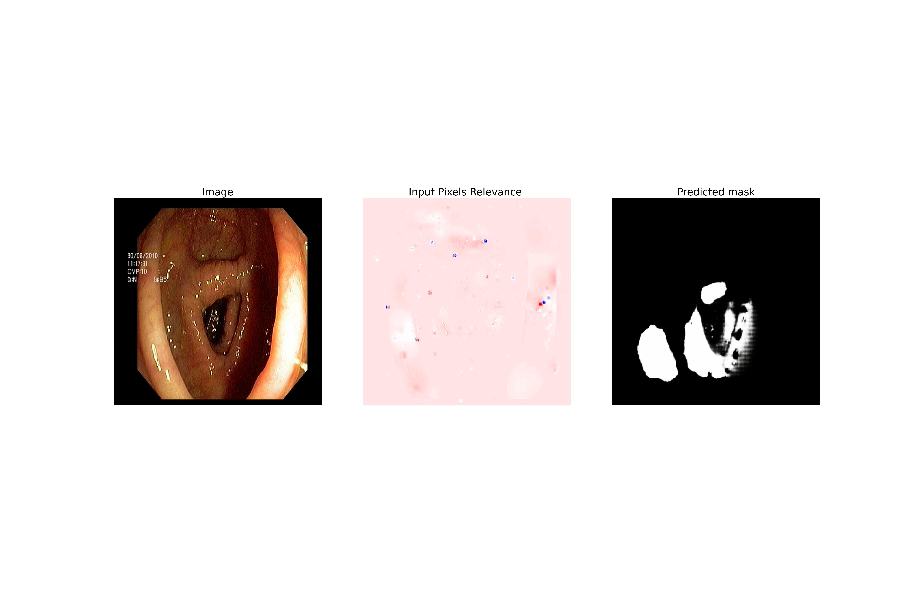
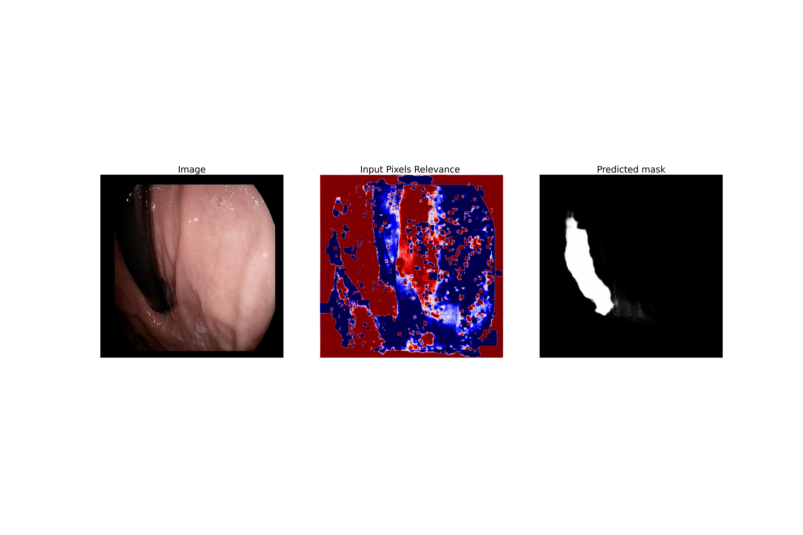
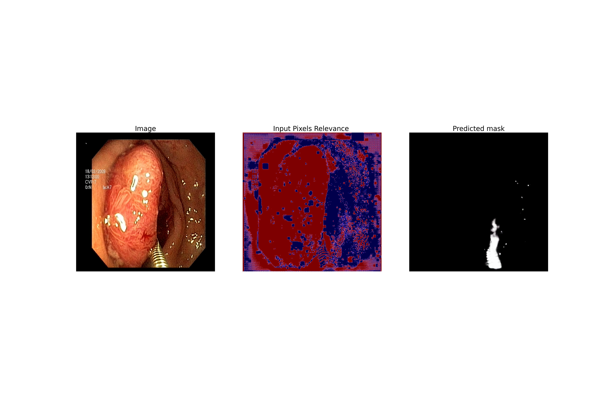
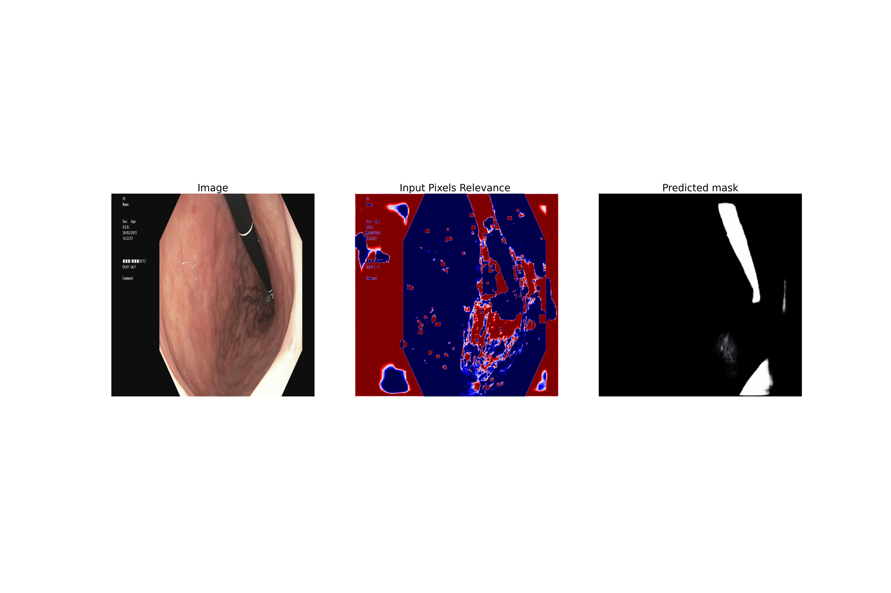
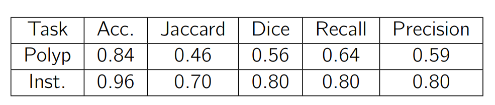

# MedAI: Transparency in Medical Image Segmentation

# What is this repo
This repo contains the code and experiments that are implemented to contribute in MedAI Cahllenge: Transparency in Medical Image Segmentation to automate medical image segmentation while preserve transparency. In the paper below we proposed generative adversarial network-based models to segment both polyps and instruments in endoscopy images. We also provide explanations for the predictions using a layer-wise relevance propagation approach.  

# Reference papers
## Woriking paper:

## Challenge details paper
  
BibTeX:  
@article{MediAI2021,
    title = {{MedAI: Transparency in Medical Image Segmentation}},
    author = {
        Hicks, Steven and
        Jha, Debesh and
        Thambawita, Vajira and
        Riegler, Michael and
        Halvorsen, P{\aa}l and
        Singstad, Bj{\o}rn-Jostein and
        Gaur, Sachin and
        Pettersen, Klas and
        Goodwin, Morten and
        Parasa, Sravanthi and
        de Lange, Thomas
    },
    journal = {Nordic Machine Intelligence},   
    year = {2021},
    doi = {10.5617/nmi.9140}
    

  

# Results

The repository consists of ipynb files of the experiment already run. It still shows the outputs that were not deleted to give insigts about the results.  

# Model 1

# Transfer Learning

# Evaluation

